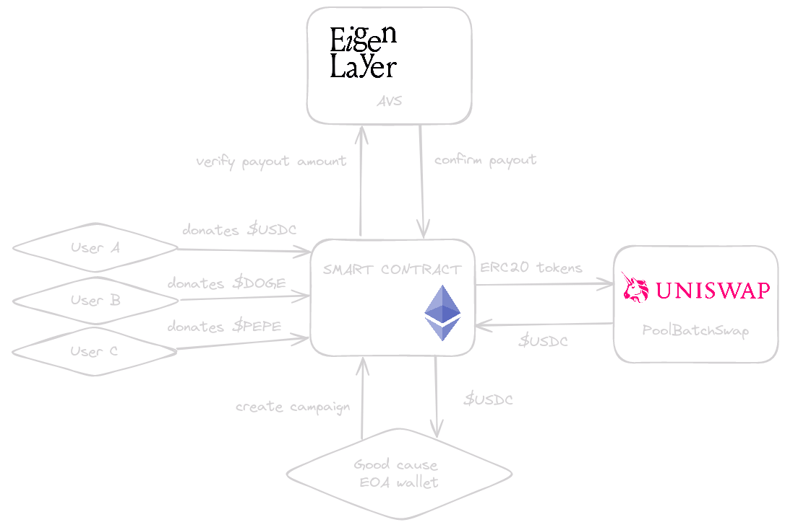
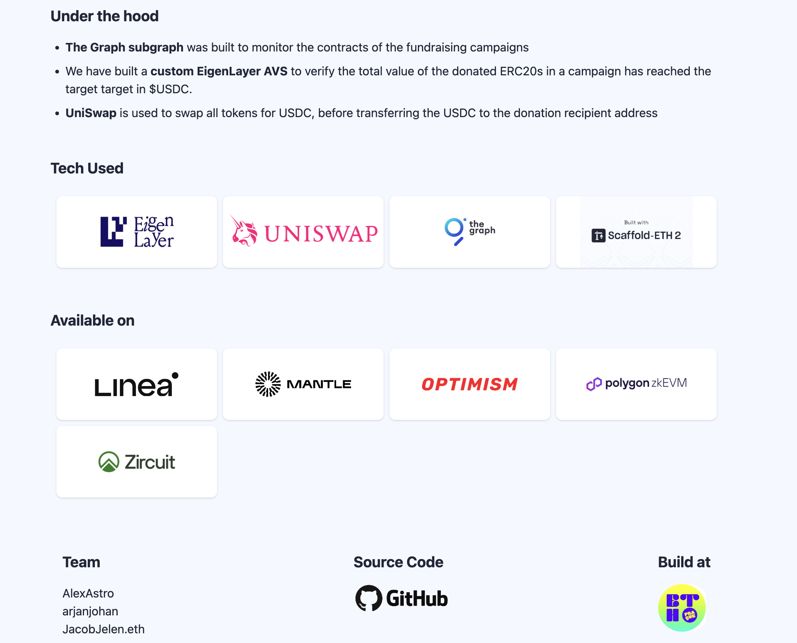
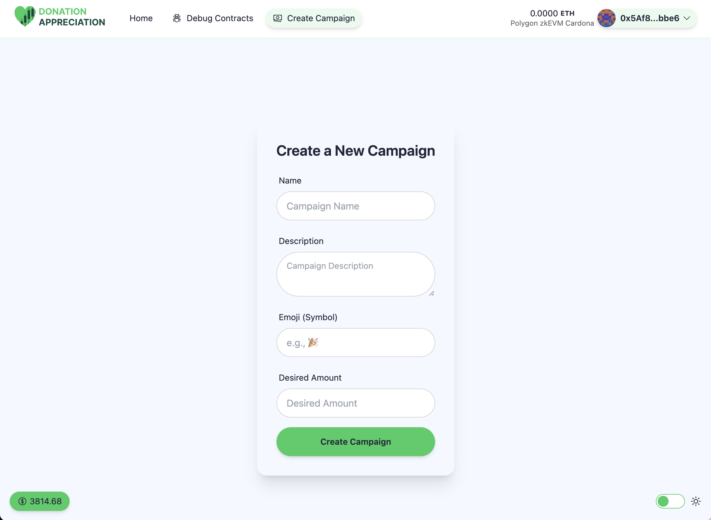
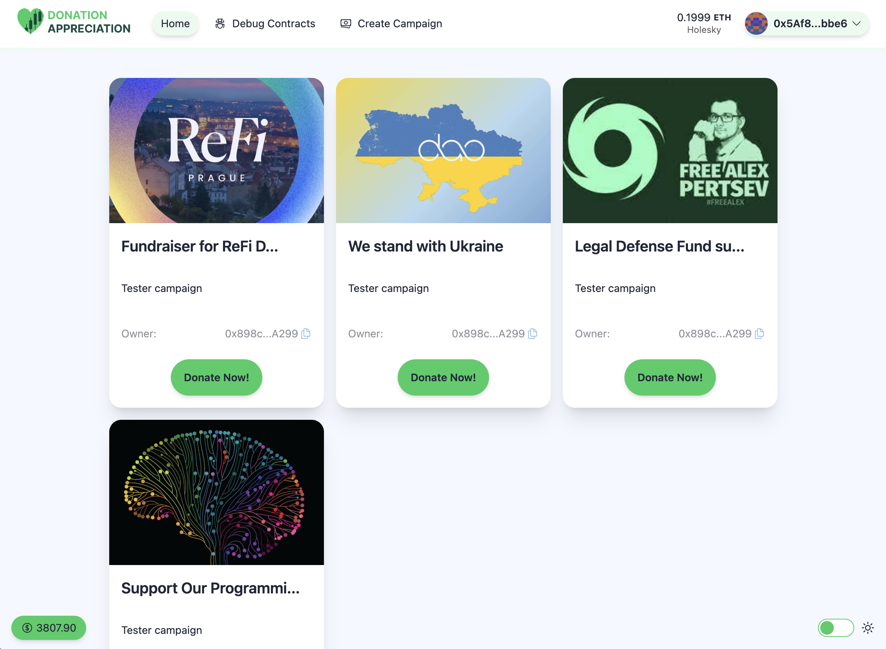
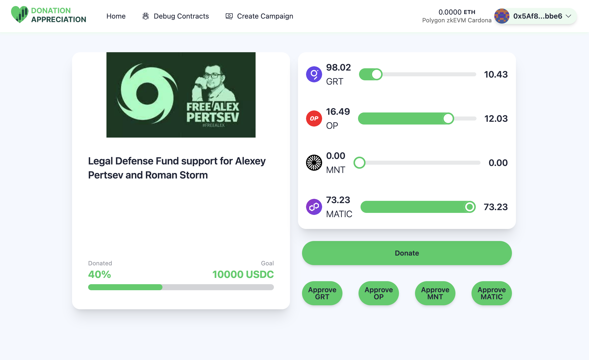

# 🫶 Eigen Donation

<h4 align="center">
  
   
    |
  <a href="https://donationappreciation.vercel.app/">Website</a>
</h4>

Eigen Donation is a donation dApp that accepts shitcoins (all ERC20 tokens). A donation campaign is registered in the smart contract, and it determines a runtime and $USDC target for the donation. When the donation hits the target value (in $USDC), UniSwap is used to swap all tokens for $USDC, before transferring the $USDC to the donation recipient address. To check if the donation ERC20 holdings are greater than the donation target before swapping, we created an EigenLayer AVS that verifies this.

⚙️ Built using EigenLayer, The Graph, Uniswap NextJS, Hardhat, and Wagmi.

- 🗳️ **Quickly create a donation campaign**: On our frontend it's easy to setup a new campaign, just define a a campaign name, set a target (in $USDC) and you're ready to go.
- 🪝 **New Uniswap hooks**: TODO
- 🪙 **Accept all ERC20**: Donations can accept any ERC20 tokens, which will be swapped to $USDC at the end of the campaign.
- 📈 **Multiple ways to hit target**: Reach your donation targets either by new donations or by increase in token price of current donations.
- 🔐 **Secured with Eigenlayer AVS**: We use a custom EigenLayer AVS to verify the target is reached before swapping all ERC20 tokens to $USDC.

## Diagram

## Screenshots

| Landing Page                   | Create Campaign              |
| ------------------------------ | ---------------------------- |
|  |  |

| Campaigns Overview              | Campaign details                 |
| ------------------------------- | -------------------------------- |
|  |  |

## Hackathon tracks

###

### Eigenlayer - Best use of EigenLayer AVS

We created our own Eigenlayer AVS to verify the total value of the donated ERC20 in a single campaign are at least equal to the campaign target in $USDC. When the EigenLayer stakers verify this, the campaign can close, swap all tokens to the target value in $USDC. When the swap is completed but the value turns out to be lower than the campaign target, validators get slashed. It's easy to verify, so the bonding period to withdraw can be very short in our case.

Also we fixed a bug in the Hello World repo, which caused issues when executing the make commands. After the hackathon we will submit a PR to the repo for this. Also we added 1 additional step in the readme, to help people get started more easily.

- [Github AVS repo](https://github.com/prahahackers24/AVS-PRAGUE)
- [Bugfix](https://github.com/prahahackers24/AVS-PRAGUE/blob/fe4c2c893bbc27046006a4c1b04e01d217dad29b/Makefile#L48-L52)
- [Readme update](https://github.com/prahahackers24/AVS-PRAGUE/blob/fe4c2c893bbc27046006a4c1b04e01d217dad29b/README.md?plain=1#L27)

## Links

- [Vercel deployment](https://donationappreciation.vercel.app/)
- [The Graph Subgraph](https://api.studio.thegraph.com/query/72991/donation/version/latest)
- [DonationContract.sol on Sepolia](https://sepolia.etherscan.io/address/0x4095001d8d00c2c7f38b659173f9a2f2f1781a16)
- [PoolBatchSwapTest.sol on Sepolia](0x3f1e9D9cfdB1b44feD1769C02C6AE5Bb97aF7E34)

## Next steps

What can be improved?

- **Cross-chain campaigns -** Currently, each campaign lives on a single chain. We are investigating the possibility of making campaigns cross-chain. This means executing the swap function on each chain simultaneously. Is it possible to have an EigenLayer AVS that validates data across different chains?
- **Filter out potential malicious actors -** Use new AVS to filter donation creators (only accept legitimate fundraisers).
- **Optional filtering of accepted tokens -** Campaigns could be directed to a more specific community.
